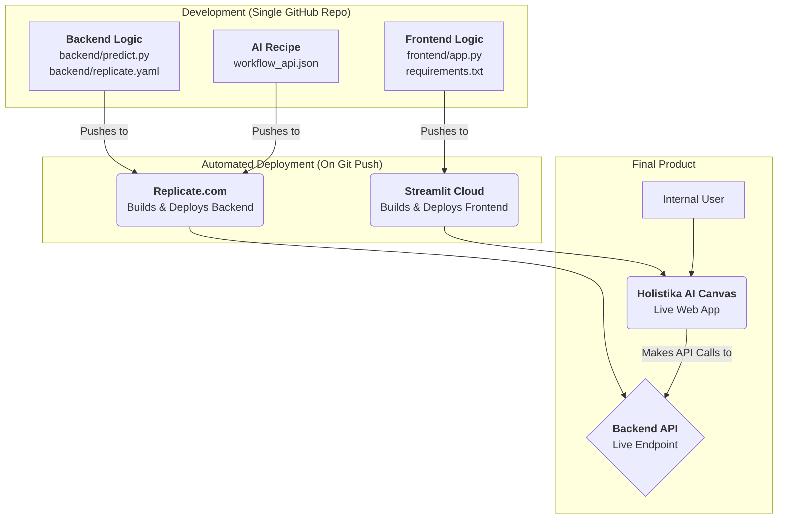

# 🎨 Holistika AI Canvas

This repository contains the full-stack source code for the Holistika AI Canvas, an internal tool for generative visual AI. The project is designed for a fully-automated deployment workflow using Git.

## 🚀 The Workflow

This project follows SOP-AI_VISUAL_APP_001. The core principle is simple: **a `git push` to this repository automatically deploys a live backend API on Replicate and a live frontend web application on Streamlit Community Cloud.**

This eliminates the need for local Docker builds or manual deployment steps.



## 🛠️ Deployment Steps

Follow these steps to deploy the application from scratch.

### 1. GitHub Repository
Ensure all the code from this project is in a single GitHub repository.

### 2. Deploy the Backend to Replicate
The backend is the AI model that runs the ComfyUI workflow.

1.  Sign in to [Replicate](https://replicate.com) with your GitHub account.
2.  Go to the **Models** section and click **Create a new model**.
3.  Choose **Connect with GitHub** and select your repository.
4.  Replicate will automatically detect the `replicate.yaml` file in the `backend/` directory and start building your model.
5.  Once the build is successful, you will have a live model page. Copy the **Model Version ID** (it's a long string of characters). You will need this for the frontend.

### 3. Deploy the Frontend to Streamlit Cloud
The frontend is the interactive web UI where users will interact with the model.

1.  Sign in to [Streamlit Community Cloud](https://share.streamlit.io) with your GitHub account.
2.  Click **New app** and choose your repository.
3.  Set the **Branch** to `main` (or your development branch).
4.  Set the **Main file path** to `frontend/app.py`.
5.  Click on **Advanced settings...**.
6.  In the **Secrets** section, add your Replicate API token:
    ```toml
    REPLICATE_API_TOKEN = "r8_YourReplicateTokenHere..."
    ```
7.  Click **Deploy!**. Streamlit will now build and deploy your application.

### 4. Connect the Frontend to the Backend
The final step is to tell the frontend app which Replicate model to talk to.

1.  Open the `frontend/app.py` file.
2.  Find the `MODEL_ENDPOINT` variable.
3.  Replace the placeholder with the **Model Version ID** you copied from Replicate in Step 2.5. The format should be `your-replicate-username/your-model-name:version_id`.
    ```python
    # frontend/app.py
    MODEL_ENDPOINT = "your-username/your-model-name:a1b2c3d4e5f6..." # <-- IMPORTANT
    ```
4.  **Commit and push this change** to your GitHub repository.
5.  Streamlit Cloud will automatically detect the change and redeploy your app.

Your Holistika AI Canvas is now live and fully operational.

## ⚙️ Configuration

-   **AI Logic**: The image generation process is defined in `workflow_api.json`. If you change the workflow (e.g., using a different model or adding new inputs), you must update this file. Remember to also update `backend/predict.py` if your input node IDs change.
-   **Model Dependencies**: Any new Python packages required for the backend model should be added to `backend/replicate.yaml`.
-   **UI Dependencies**: Any new Python packages required for the Streamlit app should be added to `requirements.txt`. 