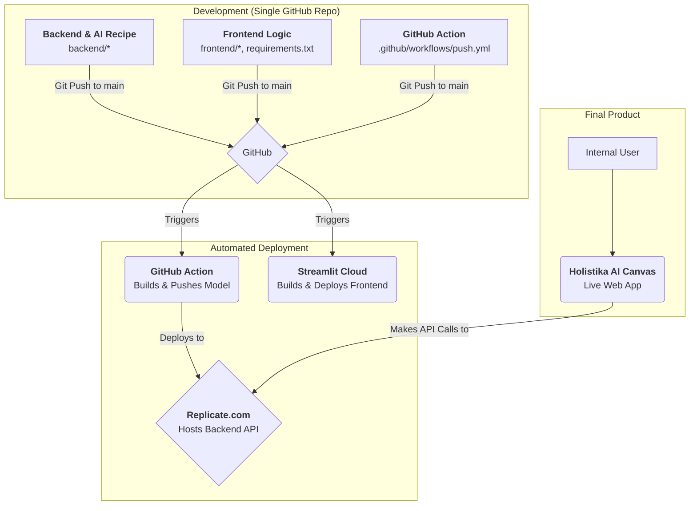

# 🎨 Holistika AI Canvas

This repository contains the full-stack source code for the Holistika AI Canvas. The project is designed for a CI/CD workflow using GitHub Actions to deploy the backend, and Streamlit Cloud for the frontend.

## 🚀 The Workflow

This project is configured for a full CI/CD pipeline:

1.  **Backend**: Pushing a change to the `main` branch automatically triggers a **GitHub Action**. This action builds the model from the `backend/` directory and deploys it to Replicate.
2.  **Frontend**: Pushing a change to the `main` branch also triggers an automatic deployment on **Streamlit Cloud**, updating the UI.

This means a single `git push` updates both your live backend and frontend.



## 🛠️ One-Time Setup

You only need to perform these steps once to connect your repository to the cloud services.

### 1. Backend Connection (Replicate)

1.  **Create a Model on Replicate**: Go to [replicate.com/create](https://replicate.com/create) and create a "blank" model page (e.g., `your-username/your-model-name`).
2.  **Add Replicate Token to GitHub**:
    *   Get your API token from [replicate.com/auth/token](https://replicate.com/auth/token).
    *   In your GitHub repo, go to `Settings` > `Secrets and variables` > `Actions`. Add it as a repository secret named `REPLICATE_CLI_AUTH_TOKEN`.
3.  **Set Replicate Model Name in GitHub**:
    *   In the same `Actions` settings area, go to the **Variables** tab.
    *   Create a new repository variable named `REPLICATE_MODEL_NAME`.
    *   Set its value to the destination model name from Step 1 (e.g., `your-username/your-model-name`).

### 2. Frontend Connection (Streamlit Cloud)

1.  **Sign in** to [Streamlit Community Cloud](https://share.streamlit.io) with your GitHub account.
2.  Click **New app** and choose this repository.
3.  Set the **Main file path** to `frontend/app.py`.
4.  Under **Advanced settings**, add your `REPLICATE_API_TOKEN` to the **Secrets**.
5.  Click **Deploy!**.

## 🚀 Ongoing Deployment

With the one-time setup complete, your workflow is now simple:

1.  Make your changes to the frontend or backend code.
2.  **Commit and push** your changes to the `main` branch.
    ```bash
    git commit -am "Updated model logic"
    git push
    ```
3.  Both Replicate and Streamlit Cloud will automatically deploy the new versions.
4.  **Important**: After the first successful backend deployment, you must copy the new **version ID** from Replicate and paste it into the `MODEL_ENDPOINT` variable in `frontend/app.py`. Commit and push this change one last time to connect the live frontend to the live backend.

## 🛠️ Configuration

-   **AI Logic**: The image generation process is defined in `backend/workflow_api.json`. If you change the workflow (e.g., using a different model or adding new inputs), you must update this file. Remember to also update `backend/predict.py` if your input node IDs change.
-   **Model Dependencies**: Any new Python packages required for the backend model should be added to `backend/cog.yaml`.
-   **UI Dependencies**: Any new Python packages required for the Streamlit app should be added to `requirements.txt`. 